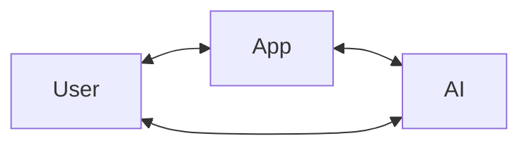
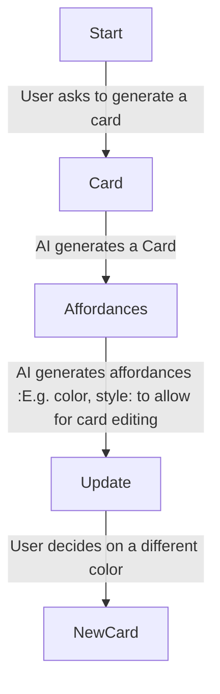

# AUX High Level Design (HLD)

The purpose of this document is to discuss a design of a User Interface and experience (UI/UX) for powering Artificial
General Intelligence (AGI) applications. This is a high level design doc, we would only be exploring solutions here,
implementation details about each solution/idea is not in scope for this doc.

# Background

Artificial Intelligence (AI) is man made intelligence i.e. recreating human intelligence in machines. Artificial
General Intelligence (AGI) is a AI that has general intelligence i.e. intelligence across brad categories or domains.
When AGI is developed, it would require a novel User interface and User experience design, whatever interface or
experience we develop would be the ultimate representation of a Human-Machine Interface.

Before the inevitable development of AGI, we would need to come up with a UI/UX that would allow us to utilize the full
capability of these AGI systems while provide a seamless and intuitive user experience to humans.

# Requirements

Before proposing a possible solution to the problem at hand, we need describe the value an AI powered application
offers.

## Interactivity

All the value that an AI system will offer can not be done without interactivity. We believe this is because it is hard
for AI to know in one-shot exactly what the human needs. For example when a user asks the AI to generate a greeting
card, they AI could generate one but the chances the user would accept it as what they wanted or imagine is low. The AI
could be wrong about the style they wanted, the color or even the font used. So, no matter the capability of the system,
it will always need to be interactive.

## Intention

All value the AI system is expected to offer is based on intentions. The whole point of interactivity is to hone in on
intention. Intention is not always clear to the AI when its first communicated by the human, this is why interactivity
is important but intention is not also always clear to the human as well, that is why they would find it hard to
communicate as well. So, it is important the AI can figure out intentions from interacting with users to ensure they
provide the value they want.

## Context

All value is provide in context of something. When a user ask the AI to move, in the context of a music player it could
be to go to the next song, and in the context of photo gallery it would be to go to the next image. CContext and
intention are intertwined, one is required to figure out the other.

The general use of AI for any application would be in this form

> A user and an AI system would collaborate in the context of an application, the user can interact with the AI to query
> information about the context, the user can carry out actions in the context or ask the AI to do so.



The above form covers all use cases an AI application would provide. For example, a user who is a writer can work with
an AI in the context of a Word application. The User can query information about the document from the AI or the user
can modify the document or ask the AI to do so.

The following captures all the requirements for the system

> Enhanced user experience for any application by providing affordances

```text
As a User,
I want better user experience for any application,
So I can get the most out of any application
```

# Proposed design

The ultimate UI/UX for an AI powered application would be one where there are affordances generated dynamically on the
fly to facilitate interaction between the User and the AI in the context of the application. Here is an example of a
greeting card application powered by an AI system




# References

# Appendix

